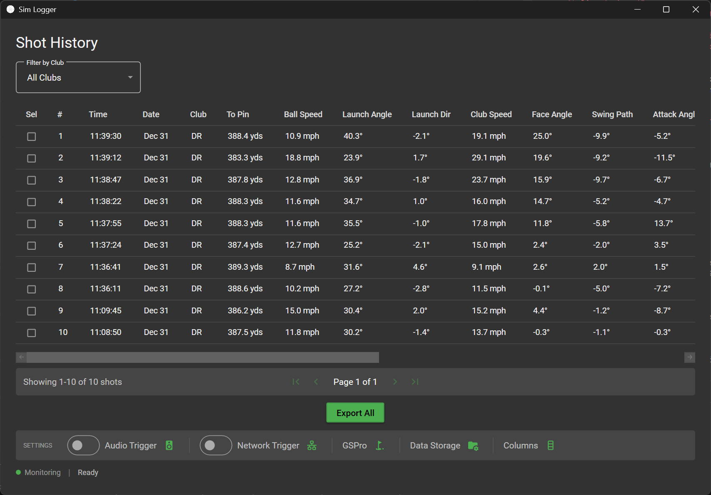

# Sim Logger

A Windows desktop application for viewing and exporting golf shot data from [GSPro](https://gsprogolf.com/) golf simulator. Additional features include the ability to trigger third party swing recording software as well as AI shot analysis using your AI Assistant of choice via the provided MCP server.

  

## Features

### Shot Management
- **Real-time monitoring** - Detects shots instantly via network traffic monitoring (requires Npcap)
- **File monitoring fallback** - Falls back to database polling when real-time is disabled
- **Shot list view** - Browse all shots with club, ball speed, carry distance, etc.

### Swing Recording - Audio & Network Trigger
- **Audio Trigger** - Allows you to trigger swing recording software like [Kinovea](https://www.kinovea.org/) or [Swing Catalyst](https://swingcatalyst.com/) using the audio trigger option and by listening to the virtual audio cable output. 
- **Network Trigger** - Use the new network trigger option in Kinovea 2025.1.1
- **Device selection** - Route audio to any output device (useful for [virtual audio cables](https://vb-audio.com/Cable/))

### Export
- **CSV export** - Export synced shots to CSV for analysis in Excel or other tools
- **Shot Pattern export** - Export synced shots to a CSV format compatible with the [Shot Pattern](https://shotpattern.app/) app.

### MCP Server (AI Integration)
- **AI Analysis** - Connect AI assistants like Claude Desktop to query and analyze your shot data
- **Available Tools**:
  - `get_recent_shots` - Get recent shots with all metrics
  - `get_shot_details` - Full details for a specific shot
  - `search_shots` - Search by club, date, or distance
  - `get_club_averages` - Average stats for a club
  - `get_all_club_statistics` - Stats for all clubs
  - `compare_clubs` - Compare two clubs side-by-side
  - `list_clubs` - List all clubs in your bag

#### MCP Setup (Claude Desktop)

1. **Locate the executable**

   Find the full path to `SimLogger.exe`. If you extracted the release to `C:\SimLogger`, the path would be:
   ```
   C:\SimLogger\SimLogger.exe
   ```

2. **Open the Claude Desktop config file**

   Open or create the file at:
   ```
   %APPDATA%\Claude\claude_desktop_config.json
   ```

   You can paste this path directly into Windows Explorer or Run dialog (Win+R).

3. **Add the SimLogger MCP server configuration**

   ```json
   {
     "mcpServers": {
       "simlogger": {
         "command": "C:\\SimLogger\\SimLogger.exe",
         "args": ["--mcp"]
       }
     }
   }
   ```

   Replace `C:\\SimLogger\\SimLogger.exe` with your actual path. Note: Use double backslashes (`\\`) in JSON.

4. **Restart Claude Desktop**

   Close and reopen Claude Desktop for the changes to take effect.

5. **Verify the connection**

   In Claude Desktop, you should see "simlogger" listed as an available MCP server. Try asking:
   - "How many shots do I have recorded?"
   - "Show me my driver statistics"
   - "Compare my 7 iron to my 8 iron"

## Real-time Shot Detection Setup

Real-time monitoring captures network traffic between your launch monitor software and GSPro, triggering audio/network notifications the instant a shot is detected - before GSPro writes to its database. This is essential for accurate swing recording synchronization.

### Requirements for Real-time Monitoring
1. **Install Npcap** - Download from [npcap.com](https://npcap.com/) (free for personal use)
   - During installation, select "Install Npcap in WinPcap API-compatible Mode"
2. **Run as Administrator** - SimLogger requires admin privileges for packet capture

### Configuration
1. Enable the **Realtime** toggle in the settings bar
2. Click the signal icon to configure the GSPro API port:
   - **Port 12321** - ProTee VX / ProTee Labs connector (default)
   - **Port 921** - OpenConnect API (other launch monitors)
3. Restart SimLogger for changes to take effect

The status bar shows the current monitoring mode:
- **Real-time** - Active packet monitoring on the configured port
- **File monitoring** - Fallback mode using database polling (triggers disabled)

> **Note:** Audio and Network triggers only fire in Real-time mode. File monitoring mode only updates the shot list.

## Requirements

- Windows 10/11 x64
- [GSPro Golf Simulator](https://gsprogolf.com/)
- Launch monitor connected to GSPro (e.g., [ProTee VX](https://proteelaunchmonitors.com/))
- Optional: [Npcap](https://npcap.com/) - Required for real-time shot detection
- Optional: [Kinovea](https://www.kinovea.org/) or [Swing Catalyst](https://swingcatalyst.com/)
- Optional: [VB-Cable Virtual Audio Device](https://vb-audio.com/Cable/)


## Installation

1. Download the [latest release](https://github.com/jontheophilus/sim-logger/releases/latest)
2. Extract to desired location
3. Run `SimLogger.exe`

## Building from Source

```bash
# Clone the repository
git clone https://github.com/jontheophilus/sim-logger.git
cd sim-logger

# Build the solution
dotnet build

# Run the application
dotnet run --project SimLogger.UI
```

## License

MIT License

## Note

This project was built with help from [Claude Code](https://claude.com/claude-code).